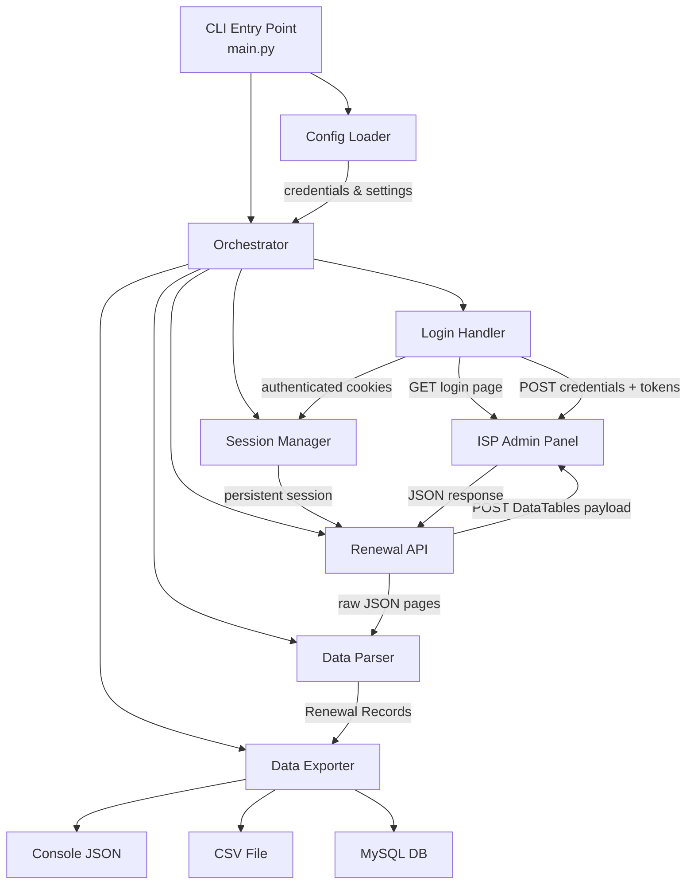
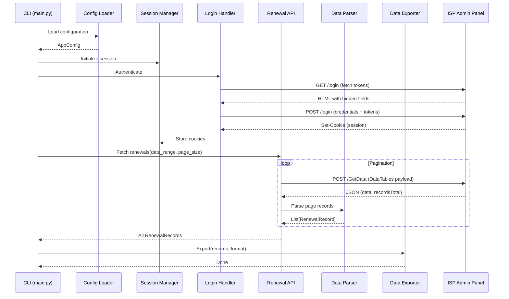
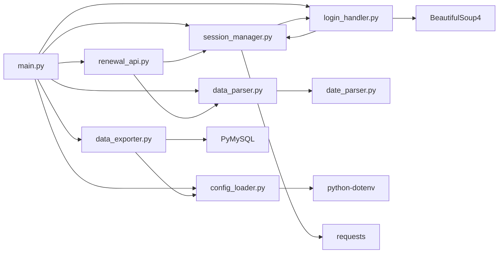

# Design Document: IMS Data Fetcher

## Overview

IMS Data Fetcher is a modular Python CLI application that automates authenticated data extraction from an ISP admin panel. The system authenticates via ASP.NET form-based login (handling anti-forgery tokens), maintains persistent HTTP sessions, fetches paginated renewal data through DataTables-compatible API calls, normalizes ASP.NET date formats, and exports results to console (JSON), CSV, or MySQL.

The architecture follows a pipeline pattern: **Configuration → Authentication → Data Fetching → Parsing → Export**. Each stage is encapsulated in a dedicated module with clear interfaces, enabling independent testing and replacement.

### Key Design Decisions

1. **`requests.Session()` for session management** — Provides automatic cookie persistence, connection pooling, and header management without external dependencies.
2. **Modular pipeline architecture** — Each module (config, login, session, API, parser, exporter) has a single responsibility and communicates through well-defined data structures.
3. **Retry with exponential backoff** — Handles transient network failures gracefully without overwhelming the target server.
4. **Environment-based configuration** — Credentials never appear in source code; `python-dotenv` loads `.env` files with system environment variables taking precedence.
5. **Defensive parsing** — ASP.NET date formats and DataTables responses are validated before processing, with clear error messages for debugging.

## Architecture

### High-Level Architecture



### Data Flow



### Module Dependency Graph



## Components and Interfaces

### Module: `config_loader.py`

Responsible for loading, validating, and providing application configuration.

```python
from dataclasses import dataclass, field
from typing import List, Optional

@dataclass(frozen=True)
class AppConfig:
    """Immutable application configuration."""
    login_url: str
    username: str
    password: str
    
    # Optional MySQL config
    mysql_enabled: bool = False
    mysql_host: Optional[str] = None
    mysql_port: int = 3306
    mysql_database: Optional[str] = None
    mysql_user: Optional[str] = None
    mysql_password: Optional[str] = None
    
    # Operational settings
    retry_count: int = 2
    connection_timeout: int = 30
    read_timeout: int = 60
    page_size: int = 10
    date_format: str = "yyyy/MM/dd"
    export_formats: List[str] = field(default_factory=lambda: ["console"])
    
    # Feature flags
    debug_mode: bool = False
    diagnostic_mode: bool = False
    file_logging: bool = False

class ConfigError(Exception):
    """Raised when configuration is invalid or incomplete."""
    pass

def load_config(cli_overrides: Optional[dict] = None) -> AppConfig:
    """
    Load configuration from environment variables and .env file.
    System env vars take precedence over .env file values.
    CLI overrides take precedence over both.
    
    Raises:
        ConfigError: If required variables are missing or invalid.
    """
    ...

def validate_url(url: str) -> bool:
    """Validate that URL has HTTP/HTTPS scheme and valid host."""
    ...

def validate_date_format(fmt: str) -> bool:
    """Validate date format contains only valid specifiers (y, M, d, /, -)."""
    ...
```

### Module: `session_manager.py`

Manages the HTTP session lifecycle, cookie persistence, retries, and re-authentication.

```python
import requests
from typing import Optional, Callable

class AuthenticationError(Exception):
    """Raised when authentication fails or session cannot be refreshed."""
    pass

class SessionManager:
    """
    Manages a requests.Session() with automatic cookie persistence,
    retry logic, and transparent re-authentication.
    """
    
    def __init__(
        self,
        connection_timeout: int = 30,
        read_timeout: int = 60,
        max_retries: int = 2,
        reauth_callback: Optional[Callable] = None
    ):
        self._session: requests.Session = requests.Session()
        self._connection_timeout = connection_timeout
        self._read_timeout = read_timeout
        self._max_retries = max_retries
        self._reauth_callback = reauth_callback
        self._reauth_timestamps: list = []
    
    @property
    def session(self) -> requests.Session:
        """Access the underlying requests.Session."""
        ...
    
    def get(self, url: str, **kwargs) -> requests.Response:
        """
        Perform GET request with retry and re-auth logic.
        
        Raises:
            AuthenticationError: If re-auth fails or rate-limited.
            requests.RequestException: If all retries exhausted.
        """
        ...
    
    def post(self, url: str, data=None, **kwargs) -> requests.Response:
        """
        Perform POST request with retry and re-auth logic.
        
        Raises:
            AuthenticationError: If re-auth fails or rate-limited.
            requests.RequestException: If all retries exhausted.
        """
        ...
    
    def _execute_with_retry(self, method: str, url: str, **kwargs) -> requests.Response:
        """
        Execute HTTP request with exponential backoff retry.
        Retries on: connection errors, timeouts, 5xx responses.
        Immediate failure on: 4xx (except 401, 403, 429).
        Re-authenticates on: 401, 403.
        """
        ...
    
    def _should_retry(self, response: requests.Response) -> bool:
        """Determine if response warrants a retry."""
        ...
    
    def _handle_auth_failure(self, response: requests.Response) -> None:
        """Trigger re-authentication, enforcing rate limit (3 per 60s)."""
        ...
```

### Module: `login_handler.py`

Handles the complete ASP.NET login flow including token extraction.

```python
from typing import Dict
from bs4 import BeautifulSoup

class LoginError(Exception):
    """Raised when login fails."""
    pass

class LoginParsingError(LoginError):
    """Raised when login page HTML cannot be parsed for tokens."""
    pass

class LoginHandler:
    """
    Automates ASP.NET form-based login with hidden token extraction.
    """
    
    def __init__(self, session_manager: 'SessionManager', config: 'AppConfig'):
        self._session_manager = session_manager
        self._config = config
    
    def authenticate(self) -> None:
        """
        Perform full login flow:
        1. GET login page to extract hidden tokens
        2. POST credentials + tokens to login endpoint
        3. Validate response contains session cookies
        
        Raises:
            LoginError: If authentication fails.
            LoginParsingError: If token extraction fails.
        """
        ...
    
    def _extract_hidden_fields(self, html: str) -> Dict[str, str]:
        """
        Parse HTML and extract all hidden input field name/value pairs.
        Targets: __VIEWSTATE, __VIEWSTATEGENERATOR, __EVENTVALIDATION,
                 __RequestVerificationToken, and any other hidden inputs.
        
        Raises:
            LoginParsingError: If HTML parsing fails.
        """
        ...
    
    def _validate_login_response(self, response) -> None:
        """
        Validate that login response indicates success:
        - Status 200 with Set-Cookie header containing session cookie.
        
        Raises:
            LoginError: If validation fails.
        """
        ...
```

### Module: `renewal_api.py`

Constructs DataTables payloads and handles paginated data fetching.

```python
from typing import List, Optional
from datetime import date

class PayloadConstructionError(Exception):
    """Raised when DataTables payload cannot be constructed."""
    pass

class RenewalAPI:
    """
    Fetches renewal data from /MISReport/UpcommingRenewal/GetData
    using DataTables-compatible server-side processing payloads.
    """
    
    ENDPOINT_PATH = "/MISReport/UpcommingRenewal/GetData"
    
    COLUMNS = [
        "UserId", "CustName", "MobileNo", 
        "PlanName", "Amount", "PlanExpiryDate", "ZoneName"
    ]
    
    def __init__(
        self,
        session_manager: 'SessionManager',
        base_url: str,
        page_size: int = 10,
        date_format: str = "yyyy/MM/dd"
    ):
        self._session_manager = session_manager
        self._base_url = base_url
        self._page_size = page_size
        self._date_format = date_format
        self._draw_counter = 0
    
    def fetch_all_renewals(
        self,
        from_date: date,
        to_date: date,
        search_term: Optional[str] = None
    ) -> List['RenewalRecord']:
        """
        Fetch all renewal records across all pages.
        Stops when: cumulative records >= recordsTotal OR empty page received.
        
        Returns:
            List of parsed RenewalRecord objects.
        """
        ...
    
    def _build_datatables_payload(
        self,
        start: int,
        length: int,
        from_date: date,
        to_date: date,
        search_term: Optional[str] = None
    ) -> dict:
        """
        Construct a DataTables-compatible POST payload.
        
        Includes: draw, columns[x][data/name/searchable/orderable],
                  order[0][column/dir], start, length, search[value],
                  FromDate, ToDate.
        
        Raises:
            PayloadConstructionError: If parameters are invalid.
        """
        ...
    
    def _fetch_page(self, payload: dict) -> dict:
        """
        Send single page request and return parsed JSON response.
        
        Returns:
            Dict with 'data' (list) and 'recordsTotal' (int) keys.
        """
        ...
```

### Module: `date_parser.py`

Converts ASP.NET `/Date(...)/ ` timestamps to Python datetime objects.

```python
import re
from datetime import datetime, timezone, timedelta

class DateParseError(ValueError):
    """Raised when date string cannot be parsed."""
    pass

# Supported range: year 2000 through year 2100
MIN_TIMESTAMP_MS = 946684800000   # 2000-01-01T00:00:00Z
MAX_TIMESTAMP_MS = 4102444800000  # 2100-01-01T00:00:00Z

# Pattern: /Date(milliseconds)/ or /Date(milliseconds±HHMM)/
ASPNET_DATE_PATTERN = re.compile(
    r'^/Date\((-?\d+)([+-]\d{4})?\)/$'
)

def parse_aspnet_date(date_string: str) -> datetime:
    """
    Convert ASP.NET date string to timezone-aware Python datetime.
    
    Formats supported:
        /Date(1234567890000)/        -> UTC datetime
        /Date(1234567890000+0530)/   -> datetime with +05:30 offset
        /Date(1234567890000-0500)/   -> datetime with -05:00 offset
    
    Args:
        date_string: Raw ASP.NET date string.
    
    Returns:
        Timezone-aware datetime object.
    
    Raises:
        DateParseError (ValueError): If format is invalid or date out of range.
    """
    ...

def datetime_to_aspnet_date(dt: datetime) -> str:
    """
    Convert Python datetime back to ASP.NET date format.
    Used for round-trip validation.
    
    Args:
        dt: Timezone-aware datetime object.
    
    Returns:
        ASP.NET date string in /Date(ms)/ or /Date(ms±HHMM)/ format.
    """
    ...
```

### Module: `data_parser.py`

Parses JSON API responses into structured RenewalRecord objects.

```python
from dataclasses import dataclass
from datetime import datetime
from typing import List, Optional
import json

@dataclass
class RenewalRecord:
    """Normalized renewal data record."""
    user_id: Optional[str]
    cust_name: Optional[str]
    mobile_no: Optional[str]
    plan_name: Optional[str]
    amount: Optional[str]
    plan_expiry_date: Optional[datetime]
    zone_name: Optional[str]

class ParseError(Exception):
    """Raised when response cannot be parsed."""
    pass

def parse_renewal_response(raw_json: dict) -> List[RenewalRecord]:
    """
    Parse a single page API response into RenewalRecord objects.
    
    Args:
        raw_json: Parsed JSON dict with 'data' key containing record list.
    
    Returns:
        List of RenewalRecord objects. Empty list if no records.
    
    Raises:
        ParseError: If response structure is invalid.
    """
    ...

def parse_record(record_dict: dict) -> RenewalRecord:
    """
    Parse a single JSON object into a RenewalRecord.
    Missing/null fields default to None.
    PlanExpiryDate is passed through date_parser.parse_aspnet_date().
    """
    ...
```

### Module: `data_exporter.py`

Exports RenewalRecord lists to console, CSV, or MySQL.

```python
from typing import List
from pathlib import Path

class ExportError(Exception):
    """Raised when export operation fails."""
    pass

class DataExporter:
    """Exports RenewalRecord data to configured targets."""
    
    FIELD_ORDER = [
        "UserId", "CustName", "MobileNo",
        "PlanName", "Amount", "PlanExpiryDate", "ZoneName"
    ]
    
    def __init__(self, config: 'AppConfig'):
        self._config = config
    
    def export_console(self, records: List['RenewalRecord']) -> None:
        """Print records as JSON with 2-space indentation to stdout."""
        ...
    
    def export_csv(self, records: List['RenewalRecord'], file_path: Path) -> None:
        """
        Write records to CSV file with header row.
        Empty records list produces header-only file.
        
        Raises:
            ExportError: If file write fails.
        """
        ...
    
    def export_mysql(self, records: List['RenewalRecord']) -> None:
        """
        Insert records into MySQL table, skipping existing UserIds.
        Empty records list performs no inserts.
        
        Raises:
            ExportError: If connection or query fails.
        """
        ...
```

### Module: `diagnostics.py`

Handles diagnostic mode data persistence.

```python
from pathlib import Path
from datetime import datetime

class DiagnosticsManager:
    """Persists raw HTTP data when diagnostic mode is enabled."""
    
    def __init__(self, enabled: bool, output_dir: Path = Path("diagnostics")):
        self._enabled = enabled
        self._output_dir = output_dir
    
    def save_request(self, url: str, method: str, payload: dict, headers: dict) -> None:
        """Save request data with timestamped filename. Masks credentials."""
        ...
    
    def save_response(self, url: str, status_code: int, headers: dict, body: str) -> None:
        """Save response data with timestamped filename."""
        ...
    
    def log_redirect(self, url: str, status_code: int, location: str, headers: dict) -> None:
        """Log redirect with masked credentials."""
        ...
```

### Module: `main.py`

CLI entry point and orchestration.

```python
import argparse
import sys

def build_argument_parser() -> argparse.ArgumentParser:
    """
    Build CLI argument parser.
    Arguments: --from-date, --to-date, --page-size, --debug, --export
    """
    ...

def main() -> int:
    """
    Main orchestration:
    1. Parse CLI arguments
    2. Load configuration
    3. Initialize session manager
    4. Authenticate
    5. Fetch renewal data
    6. Export results
    
    Returns:
        Exit code (0 success, 1 error).
    """
    ...

if __name__ == "__main__":
    sys.exit(main())
```

## Data Models

### RenewalRecord

| Field | Type | Source JSON Key | Notes |
|-------|------|----------------|-------|
| user_id | Optional[str] | UserId | Unique customer identifier |
| cust_name | Optional[str] | CustName | Customer display name |
| mobile_no | Optional[str] | MobileNo | Contact number |
| plan_name | Optional[str] | PlanName | Subscription plan name |
| amount | Optional[str] | Amount | Plan cost (string to preserve formatting) |
| plan_expiry_date | Optional[datetime] | PlanExpiryDate | Parsed from ASP.NET date format |
| zone_name | Optional[str] | ZoneName | Service zone/area |

### AppConfig

| Field | Type | Env Variable | Default |
|-------|------|-------------|---------|
| login_url | str | IMS_LOGIN_URL | (required) |
| username | str | IMS_USERNAME | (required) |
| password | str | IMS_PASSWORD | (required) |
| mysql_enabled | bool | IMS_MYSQL_ENABLED | false |
| mysql_host | Optional[str] | IMS_MYSQL_HOST | None |
| mysql_port | int | IMS_MYSQL_PORT | 3306 |
| mysql_database | Optional[str] | IMS_MYSQL_DB | None |
| mysql_user | Optional[str] | IMS_MYSQL_USER | None |
| mysql_password | Optional[str] | IMS_MYSQL_PASSWORD | None |
| retry_count | int | IMS_RETRY_COUNT | 2 |
| connection_timeout | int | IMS_CONN_TIMEOUT | 30 |
| read_timeout | int | IMS_READ_TIMEOUT | 60 |
| page_size | int | IMS_PAGE_SIZE | 10 |
| date_format | str | IMS_DATE_FORMAT | yyyy/MM/dd |
| export_formats | List[str] | IMS_EXPORT_FORMATS | ["console"] |
| debug_mode | bool | IMS_DEBUG | false |
| diagnostic_mode | bool | IMS_DIAGNOSTIC | false |
| file_logging | bool | IMS_FILE_LOGGING | false |

### DataTables Request Payload Structure

```json
{
    "draw": 1,
    "columns[0][data]": "UserId",
    "columns[0][name]": "UserId",
    "columns[0][searchable]": "true",
    "columns[0][orderable]": "true",
    "columns[1][data]": "CustName",
    "...": "...",
    "order[0][column]": "0",
    "order[0][dir]": "asc",
    "start": 0,
    "length": 10,
    "search[value]": "",
    "FromDate": "2024/01/01",
    "ToDate": "2024/12/31"
}
```

### DataTables Response Structure

```json
{
    "draw": 1,
    "recordsTotal": 150,
    "recordsFiltered": 150,
    "data": [
        {
            "UserId": "1001",
            "CustName": "John Doe",
            "MobileNo": "9876543210",
            "PlanName": "Premium 100Mbps",
            "Amount": "999",
            "PlanExpiryDate": "/Date(1704067200000)/",
            "ZoneName": "Zone-A"
        }
    ]
}
```

### MySQL Table Schema

```sql
CREATE TABLE IF NOT EXISTS renewals (
    id INT AUTO_INCREMENT PRIMARY KEY,
    user_id VARCHAR(50) UNIQUE NOT NULL,
    cust_name VARCHAR(200),
    mobile_no VARCHAR(20),
    plan_name VARCHAR(100),
    amount VARCHAR(20),
    plan_expiry_date DATETIME,
    zone_name VARCHAR(100),
    fetched_at TIMESTAMP DEFAULT CURRENT_TIMESTAMP
);
```

## Correctness Properties

*A property is a characteristic or behavior that should hold true across all valid executions of a system — essentially, a formal statement about what the system should do. Properties serve as the bridge between human-readable specifications and machine-verifiable correctness guarantees.*

### Property 1: ASP.NET Date Parsing Round-Trip

*For any* valid millisecond timestamp in the range [946684800000, 4102444800000] and any valid timezone offset (±HHMM where HH is 00-14 and MM is 00 or 30), parsing the ASP.NET date string `/Date(ms±HHMM)/` to a Python datetime and converting it back SHALL produce the original millisecond value and timezone offset.

**Validates: Requirements 10.1, 10.2, 10.5**

### Property 2: Invalid ASP.NET Date Rejection

*For any* string that does not match the pattern `/Date(digits)/` or `/Date(digits±HHMM)/`, the Date_Parser SHALL raise a ValueError containing the invalid input string.

**Validates: Requirements 10.3**

### Property 3: Out-of-Range Date Rejection

*For any* millisecond value less than 946684800000 or greater than 4102444800000, the Date_Parser SHALL raise a ValueError indicating the date is out of supported range.

**Validates: Requirements 10.4**

### Property 4: DataTables Payload Structure Completeness

*For any* valid combination of page offset (non-negative integer), page size (positive integer), date range (two valid dates where from ≤ to), and optional search term (string up to 200 characters), the constructed DataTables payload SHALL contain all required keys: `draw`, `columns[0..6][data]`, `columns[0..6][name]`, `columns[0..6][searchable]`, `columns[0..6][orderable]`, `order[0][column]`, `order[0][dir]`, `start`, `length`, `search[value]`, `FromDate`, and `ToDate` — with `FromDate` and `ToDate` formatted according to the configured date format.

**Validates: Requirements 5.1, 5.2, 5.3, 6.2**

### Property 5: Search Term Truncation

*For any* string of arbitrary length provided as a search term, the DataTables payload SHALL contain a `search[value]` field whose length is at most 200 characters, and for strings of 200 characters or fewer, the value SHALL equal the original input.

**Validates: Requirements 6.3**

### Property 6: Pagination Completeness

*For any* total record count (recordsTotal > 0) and page size (positive integer), the pagination logic SHALL request exactly `ceil(recordsTotal / page_size)` pages, with each page's `start` offset incrementing by `page_size`, and the cumulative fetched records SHALL equal `recordsTotal`.

**Validates: Requirements 6.4, 7.1, 7.2**

### Property 7: Renewal Record Field Extraction with Defaults

*For any* JSON object containing any subset of the fields {UserId, CustName, MobileNo, PlanName, Amount, PlanExpiryDate, ZoneName} with string values (or null), the Data_Parser SHALL produce a RenewalRecord where present fields have values equal to the JSON values and missing/null fields have value None.

**Validates: Requirements 9.1, 9.2**

### Property 8: Renewal Record Round-Trip Fidelity

*For any* valid RenewalRecord with non-None string fields, serializing the record to the JSON format used by the API response and parsing it back SHALL produce a RenewalRecord with field values string-equal to the original for string fields.

**Validates: Requirements 9.5**

### Property 9: Hidden Form Field Extraction

*For any* HTML document containing hidden input elements with arbitrary name/value pairs, the Login_Handler's extraction function SHALL return a dictionary containing all hidden input names mapped to their corresponding values.

**Validates: Requirements 2.2**

### Property 10: Whitespace Credential Rejection

*For any* string composed entirely of whitespace characters (spaces, tabs, newlines, or combinations thereof), the Config_Loader SHALL reject it as an invalid credential value and raise a ConfigError.

**Validates: Requirements 1.6**

### Property 11: URL Validation

*For any* string that does not begin with `http://` or `https://` followed by a non-empty host component, the Config_Loader SHALL reject it as an invalid login URL. Conversely, for any string beginning with `http://` or `https://` followed by a valid host, it SHALL be accepted.

**Validates: Requirements 12.5, 12.6**

### Property 12: Invalid Date Format Rejection

*For any* string containing characters other than the valid date format specifiers (y, M, d) and separators (/, -), the Config_Loader SHALL raise a validation error.

**Validates: Requirements 8.3**

### Property 13: Console Export Produces Valid JSON

*For any* list of RenewalRecord objects (including empty list), the console export SHALL produce output that is valid JSON parseable back into a list, with 2-space indentation.

**Validates: Requirements 11.1**

### Property 14: CSV Export Structure Integrity

*For any* list of RenewalRecord objects, the CSV export SHALL produce a file where the first row contains headers in the order [UserId, CustName, MobileNo, PlanName, Amount, PlanExpiryDate, ZoneName] and subsequent rows contain the corresponding field values with row count equal to the input record count.

**Validates: Requirements 11.2**

### Property 15: Credential Masking in Output

*For any* password, session cookie value, or authentication token present in the application state, all log output and diagnostic file output SHALL NOT contain the literal credential value.

**Validates: Requirements 14.5, 15.4**

### Property 16: Missing Config Variables Listed in Error

*For any* non-empty subset of required configuration variables that are missing, the ConfigError message SHALL contain the names of all missing variables.

**Validates: Requirements 12.3**

### Property 17: Exponential Backoff Timing

*For any* retry attempt number N (where N ≥ 1), the wait time before that retry SHALL be 2^(N-1) seconds (1s for first retry, 2s for second retry).

**Validates: Requirements 13.2**

## Error Handling

### Error Hierarchy

```
Exception
├── ConfigError                    # Configuration loading/validation failures
├── AuthenticationError            # Login and session auth failures
│   ├── LoginError                 # Login-specific failures
│   │   └── LoginParsingError      # HTML token extraction failures
│   └── SessionExpiredError        # Re-auth rate limit exceeded
├── PayloadConstructionError       # DataTables payload building failures
├── ParseError                     # JSON response parsing failures
│   └── DateParseError (ValueError) # ASP.NET date conversion failures
└── ExportError                    # Data export failures
    ├── CSVExportError             # File system write failures
    └── MySQLExportError           # Database connection/query failures
```

### Error Handling Strategy

| Error Type | Retry? | User Action | Log Level |
|-----------|--------|-------------|-----------|
| ConfigError | No | Fix configuration | ERROR |
| LoginError | Yes (2x) | Check credentials | ERROR |
| LoginParsingError | No | Check login page structure | ERROR |
| AuthenticationError (rate-limited) | No | Wait and retry manually | ERROR |
| Network timeout/connection | Yes (2x) | Check connectivity | WARNING (retry), ERROR (final) |
| HTTP 5xx | Yes (2x) | Server issue, wait | WARNING (retry), ERROR (final) |
| HTTP 4xx (not 401/403/429) | No | Fix request | ERROR |
| ParseError | No | Check API response format | ERROR |
| DateParseError | No | Check date format in response | ERROR |
| CSVExportError | No | Check file permissions/path | ERROR |
| MySQLExportError | No | Check DB connectivity | ERROR |

### Retry Logic

```python
# Exponential backoff: wait = 2^(attempt-1) seconds
# Attempt 1: immediate
# Attempt 2: wait 1s
# Attempt 3: wait 2s
# Total max wait: 3s for 2 retries

RETRYABLE_CONDITIONS = [
    ConnectionError,
    Timeout,
    lambda r: r.status_code >= 500,
]

NON_RETRYABLE_CONDITIONS = [
    lambda r: 400 <= r.status_code < 500 and r.status_code not in (401, 403, 429),
]

REAUTH_CONDITIONS = [
    lambda r: r.status_code in (401, 403),
]
```

### Credential Safety

All error messages and log output MUST:
- Replace password values with `***MASKED***`
- Replace session cookie values with `[session-cookie]`
- Replace auth token values with `[auth-token]`
- Include non-sensitive context (URLs, status codes, field names)

## Testing Strategy

### Testing Framework

- **Unit tests**: `pytest` with `pytest-mock` for mocking
- **Property-based tests**: `hypothesis` library (Python's standard PBT library)
- **HTTP mocking**: `responses` library or `pytest-httpserver`
- **Coverage**: `pytest-cov` with minimum 80% line coverage target

### Property-Based Testing Configuration

Each property test MUST:
- Use `hypothesis` with `@given` decorator
- Run minimum 100 examples per property (`@settings(max_examples=100)`)
- Include a tag comment referencing the design property
- Format: `# Feature: ims-data-fetcher, Property {N}: {title}`

### Test Organization

```
tests/
├── unit/
│   ├── test_config_loader.py       # Config loading, validation, defaults
│   ├── test_login_handler.py       # Token extraction, login flow
│   ├── test_session_manager.py     # Retry logic, re-auth, timeouts
│   ├── test_renewal_api.py         # Payload construction, pagination
│   ├── test_date_parser.py         # ASP.NET date conversion
│   ├── test_data_parser.py         # JSON parsing, field extraction
│   └── test_data_exporter.py       # Console, CSV, MySQL export
├── property/
│   ├── test_date_parser_props.py   # Properties 1, 2, 3
│   ├── test_payload_props.py       # Properties 4, 5
│   ├── test_pagination_props.py    # Property 6
│   ├── test_data_parser_props.py   # Properties 7, 8
│   ├── test_login_props.py         # Property 9
│   ├── test_config_props.py        # Properties 10, 11, 12, 16
│   ├── test_export_props.py        # Properties 13, 14
│   ├── test_security_props.py      # Property 15
│   └── test_retry_props.py         # Property 17
└── integration/
    ├── test_login_flow.py          # Full login with mocked server
    ├── test_fetch_flow.py          # Full fetch with mocked API
    └── test_mysql_export.py        # MySQL with test database
```

### Unit Test Focus Areas

- **Specific examples**: Known good/bad inputs with expected outputs
- **Edge cases**: Empty inputs, boundary values, malformed data
- **Error conditions**: Network failures, invalid responses, missing config
- **Integration points**: Module interactions (login → session, API → parser)

### Property Test Focus Areas

- **Round-trip properties**: Date parsing, record serialization (Properties 1, 8)
- **Invariants**: Payload structure, field extraction (Properties 4, 7, 14)
- **Input validation**: Rejection of invalid inputs (Properties 2, 3, 10, 11, 12)
- **Metamorphic**: Search truncation, pagination math (Properties 5, 6)
- **Security**: Credential masking (Property 15)

### Dependencies

```
# requirements.txt
requests>=2.31.0
python-dotenv>=1.0.0
beautifulsoup4>=4.12.0
PyMySQL>=1.1.0

# requirements-dev.txt
pytest>=7.4.0
pytest-mock>=3.12.0
pytest-cov>=4.1.0
hypothesis>=6.92.0
responses>=0.24.0
```

